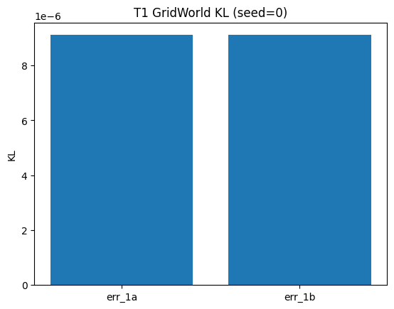

# T1 GridWorld 报告 (seed=0)

## 实验配置
- config: `configs/t1_gridworld.yaml`
- 算法: MA-LfL

## 关键指标
- err_1a = 9.108e-06
- err_1b = 9.108e-06
- weight_pcc = -0.460
- weight_rmse = 0.269

## 图表

1. KL 对比图：
   

2. 奖励热力图：
   
