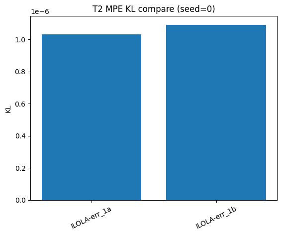

# T2 MPE 报告 (seed=0)

## 实验配置
- config: `configs/t2_mpe_simple_spread.yaml`
- 算法: I-LOLA (Stage B)

## 关键指标
- err_1a = 1.033e-06
- err_1b = 1.092e-06
- final_loss = 1.662e-01
- omega_norm = 3.723e+00

## 图表

1. KL 对比图：
   
