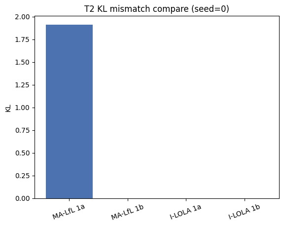
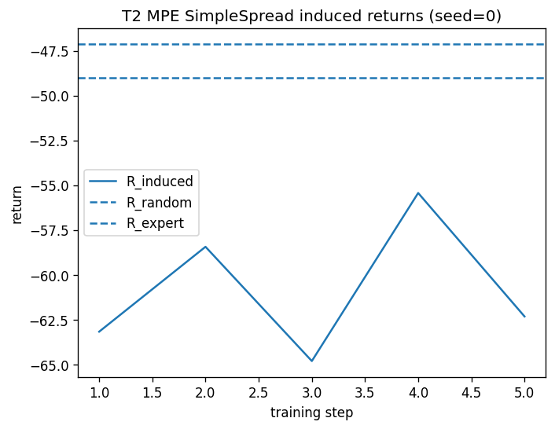

# T2 MPE 报告 (seed=0)

## 实验配置
- config: `configs/t2_mpe_simple_spread.yaml`
- 算法: I-LOLA (Stage B)

## 关键指标
- err_1a = 2.868e-07
- err_1b = 1.334e-06
- final_loss = 1.292e-01
- omega_norm = 3.490e+00

## 说明
- 这是将 MA-SPI 模型套用在 PPO 学习者上的错配实验，对比 MA-LfL 的 lookahead 和 I-LOLA。

## 图表

1. KL 对比图（MA-LfL mismatch vs I-LOLA）：
   

2. Stage A vs Stage B KL：
   
   - StageA err_1b = 2.868e-07
   - StageB err_1b = 1.334e-06

3. Induced policy 回报曲线：
   
   - R_random: -50.975
   - R_ppo_best: -55.279（PPO 各 phase 中平均回报最高者）
