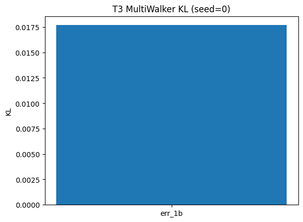
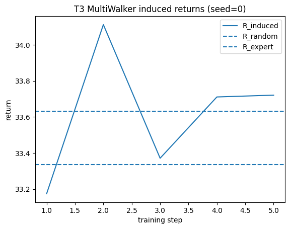

# T3 MultiWalker 报告 (seed=0)

## 实验配置
- config: `configs/t3_multiwalker.yaml`
- 场景: 连续动作协作（MultiWalker）
- 算法: I-LOLA (Stage B) + Monte Carlo KL 评估

## 关键指标
- err_1a = 0.000e+00  (连续动作下暂无 W_true 基线，固定为 0)
- err_1b = 1.769e-02  (Monte Carlo KL，states≈256，action_samples=8)
- final_loss = 2.249e-02
- omega_norm = 2.515e+00

## 图表

1. KL 柱状图：
   

2. 诱导策略回报曲线（如已生成）：
   
